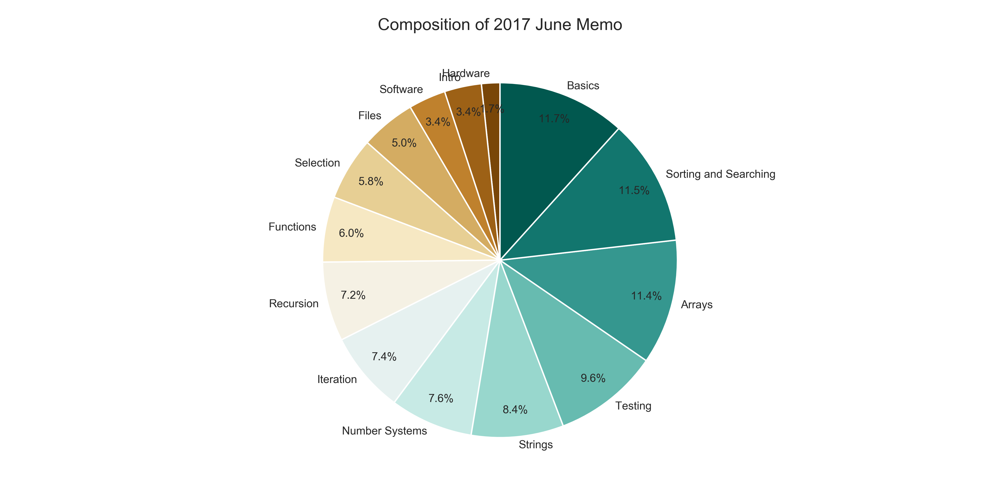
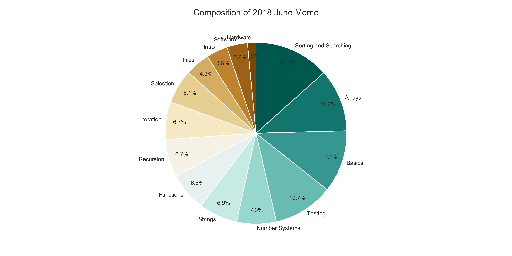

# MemosToNotes

MemosToNotes is a Python program designed for students that takes in a corpus of exam paper memorandums, as well as lecture notes for each topic that might be tested on the exam.

MemosToNotes then analyses the exams and lecture notes, giving the users useful information about the coposition of each exam paper.

